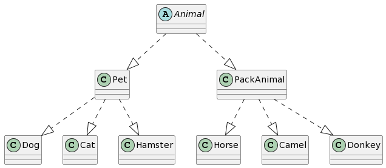

# Итоговая аттестация по блоку специализация

## Задание

1. Используя команду cat в терминале операционной системы Linux, создать два файла Домашние животные (заполнив файл собаками, кошками, хомяками) и Вьючные животными заполнив файл Лошадьми, верблюдами и ослы), а затем объединить их. Просмотреть содержимое созданного файла. Переименовать файл, дав ему новое имя (Друзья человека).

2. Создать директорию, переместить файл туда.

3. Подключить дополнительный репозиторий MySQL. Установить любой пакет из этого репозитория.

4. Установить и удалить deb-пакет с помощью dpkg.

5. Выложить историю команд в терминале ubuntu

6. Нарисовать диаграмму, в которой есть класс родительский класс, домашние животные и вьючные животные, в составы которых в случае домашних животных войдут классы: собаки, кошки, хомяки, а в класс вьючные животные войдут: Лошади, верблюды и ослы.

7. В подключенном MySQL репозитории создать базу данных “Друзья человека”

8. Создать таблицы с иерархией из диаграммы в БД

9. Заполнить низкоуровневые таблицы именами(животных), командами которые они выполняют и датами рождения

10. Удалив из таблицы верблюдов, т.к. верблюдов решили перевезти в другой питомник на зимовку. Объединить таблицы лошади, и ослы в одну таблицу.

11. Создать новую таблицу “молодые животные” в которую попадут все животные старше 1 года, но младше 3 лет и в отдельном столбце с точностью до месяца подсчитать возраст животных в новой таблице

12. Объединить все таблицы в одну, при этом сохраняя поля, указывающие на прошлую принадлежность к старым таблицам.


14. Написать программу, имитирующую работу реестра домашних животных.
В программе должен быть реализован следующий функционал:

    13.1. Завести новое животное

    13.2  Определять животное в правильный класc

    13.3  Увидеть список команд, которое выполняет животное

    13.4  Обучить животное новым командам

    13.5  Реализовать навигацию по меню

15. Создайте класс Счетчик, у которого есть метод add(), увеличивающий̆ значение внутренней̆ int переменной̆на 1 при нажатие “Завести новое животное” Сделайте так, чтобы с объектом такого типа можно было работать в блоке try-with-resources. Нужно бросить исключение, если работа с объектом типа счетчик была не в ресурсном try и/или ресурс остался открыт. Значение считать в ресурсе try, если при заведения животного заполнены все поля.

## Ход выполнения

__Используя команду cat в терминале операционной системы Linux, создать два файла Домашние животные (заполнив файл собаками, кошками, хомяками) и Вьючные животными заполнив файл Лошадьми, верблюдами и ослы), а затем объединить их. Просмотреть содержимое созданного файла. Переименовать файл, дав ему новое имя (Друзья человека). Создать директорию, переместить файл туда.__

```sh
cat > "Домашние животные" 
Собаки 
Кошки 
Хомяки 

cat > "Вьючные животные" 
Лошади 
Верблюды 
Ослы 

cat "Домашние животные" "Вьючные животные" > "Друзья человека" 

cat "Друзья человека"

mkdir Зоопарк

mv "Друзья человека" Зоопарк
```

__Подключить дополнительный репозиторий MySQL. Установить любой пакет из этого репозитория. Установить и удалить deb-пакет с помощью dpkg.__

__(Подробный разбор каждого этапа в pdf)__

```sh
sudo add-apt-repository 'deb http://repo.mysql.com/apt/ubuntu/ xenial mysql8.0'

sudo apt-get update

sudo apt-get install mysql-server
```
__Нарисовать диаграмму, в которой есть класс родительский класс, домашние животные и вьючные животные, в составы которых в случае домашних животных войдут классы: собаки, кошки, хомяки, а в класс вьючные животные войдут: Лошади, верблюды и ослы__




__В подключенном MySQL репозитории создать базу данных “Друзья человека". Создать таблицы с иерархией из диаграммы в БД. Заполнить низкоуровневые таблицы именами(животных), командами которые они выполняют и датами рождения. Удалив из таблицы верблюдов, т.к. верблюдов решили перевезти в другой питомник на зимовку. Объединить таблицы лошади, и ослы в одну таблицу. Создать новую таблицу “молодые животные” в которую попадут все животные старше 1 года, но младше 3 лет и в отдельном столбце с точностью до месяца подсчитать возраст животных в новой таблице. Объединить все таблицы в одну, при этом сохраняя поля, указывающие на прошлую принадлежность к старым таблицам.__

```sh

CREATE DATABASE IF NOT EXISTS human_friends;
USE human_friends;

CREATE TABLE Animal (
  id INT PRIMARY KEY NOT NULL AUTO_INCREMENT,
  name VARCHAR(30),
  birth_date DATE);

CREATE TABLE Pet (
  id INT PRIMARY KEY NOT NULL AUTO_INCREMENT,
  command VARCHAR(30),
  animal_id INT,
  FOREIGN KEY (animal_id) REFERENCES Animal(id));

CREATE TABLE PackAnimal (
  id INT PRIMARY KEY NOT NULL AUTO_INCREMENT,
  animal_id INT,
  FOREIGN KEY (animal_id) REFERENCES Animal(id));

CREATE TABLE Dog (
  id INT PRIMARY KEY NOT NULL AUTO_INCREMENT,
  pet_id INT,
  FOREIGN KEY (pet_id) REFERENCES Pet(id));

CREATE TABLE Cat (
  id INT PRIMARY KEY NOT NULL AUTO_INCREMENT,
  pet_id INT,
  FOREIGN KEY (pet_id) REFERENCES Pet(id));

CREATE TABLE Hamster (
  id INT PRIMARY KEY NOT NULL AUTO_INCREMENT,
  pet_id INT,
  FOREIGN KEY (pet_id) REFERENCES Pet(id));

CREATE TABLE Horse (
  id INT PRIMARY KEY NOT NULL AUTO_INCREMENT,
  pack_animal_id INT,
  FOREIGN KEY (pack_animal_id) REFERENCES PackAnimal(id));

CREATE TABLE Donkey (
  id INT PRIMARY KEY NOT NULL AUTO_INCREMENT,
  pack_animal_id INT,
  FOREIGN KEY (pack_animal_id) REFERENCES PackAnimal(id));

INSERT INTO Animal (name, birth_date) VALUES ('Animal1', '2004-04-04');
INSERT INTO Animal (name, birth_date) VALUES ('Animal2', '2002-05-05');
INSERT INTO Animal (name, birth_date) VALUES ('Animal3', '2005-14-15');

INSERT INTO Pet (command, animal_id) VALUES ('Command1', 1);
INSERT INTO Pet (command, animal_id) VALUES ('Command2', 2);
INSERT INTO Pet (command, animal_id) VALUES ('Command3', 3);

INSERT INTO Dog (pet_id) VALUES (1);
INSERT INTO Cat (pet_id) VALUES (2);
INSERT INTO Hamster (pet_id) VALUES (3);

INSERT INTO PackAnimal (animal_id) VALUES (1);
INSERT INTO PackAnimal (animal_id) VALUES (2);
INSERT INTO PackAnimal (animal_id) VALUES (3);

INSERT INTO Horse (pack_animal_id) VALUES (1);
INSERT INTO Donkey (pack_animal_id) VALUES (2);

CREATE TABLE horses_and_donkeys (
  id INT UNSIGNED NOT NULL AUTO_INCREMENT PRIMARY KEY,
  name VARCHAR(50) NOT NULL,
  command VARCHAR(100) NOT NULL,
  birth_date DATE NOT NULL,
  animal_class_id INT UNSIGNED NOT NULL);

CREATE TABLE YoungAnimals (
  id INT PRIMARY KEY NOT NULL AUTO_INCREMENT,
  name VARCHAR(40),
  age_in_months INT);

INSERT INTO YoungAnimals (name, age_in_months)
SELECT name, TIMESTAMPDIFF(MONTH, birth_date, CURDATE()) AS age_in_months
FROM Animal
WHERE birth_date >= DATE_SUB(CURDATE(), INTERVAL 3 YEAR)
AND birth_date <= DATE_SUB(CURDATE(), INTERVAL 1 YEAR);

CREATE TABLE AllAnimals (
  id INT PRIMARY KEY NOT NULL AUTO_INCREMENT,
  name VARCHAR(40),
  birth_date DATE,
  command VARCHAR(100),
  pet_id INT,
  pack_animal_id INT);

INSERT INTO AllAnimals (name, birth_date, command, pet_id)
SELECT a.name, a.birth_date, p.command, p.id
FROM Animal a
JOIN Pet p ON a.id = p.animal_id;

INSERT INTO AllAnimals (name, birth_date, pack_animal_id)
SELECT a.name, a.birth_date, pa.id
FROM Animal a
JOIN PackAnimal pa ON a.id = pa.animal_id;
```
__Написать программу, имитирующую работу реестра домашних животных.__
``````
В программе должен быть реализован следующий функционал:

14.1 Завести новое животное

14.2 определять животное в правильный класc

14.3 увидеть список команд, которое выполняет животное

14.4 обучить животное новым командам

14.5 Реализовать навигацию по меню

15.Создайте класс Счетчик, у которого есть метод add(), увеличивающий̆ значение внутренней̆int переменной̆на 1 при нажатие “Завести новое животное” Сделайте так, чтобы с объектом такого типа можно было работать в блоке try-with-resources. Нужно бросить исключение, если работа с объектом типа счетчик была не в ресурсном try и/или ресурс остался открыт. Значение считать в ресурсе try, если при заведения животного заполнены все поля.
``````
